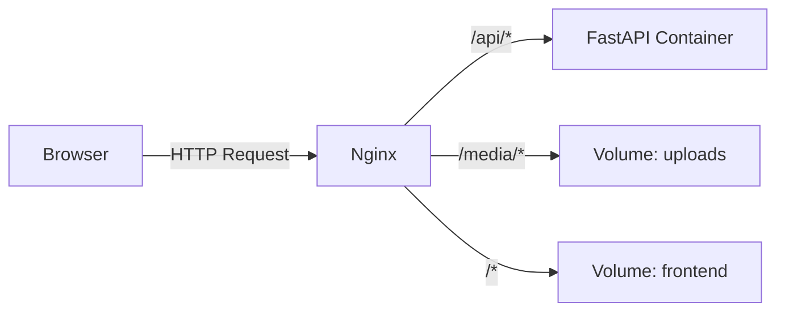

# 🏗️ Nginx Architecture

[⬅️ Back](./README.md) | [🏠 Docs Root](../../../../README.md)

## System Role
Nginx acts as the single **Entry Point** to the application from the external world.

It solves three main tasks:
1.  **Static Server:** Serves Frontend (HTML, CSS, JS) and uploaded media files (Images) directly from disk. This is much faster than serving via Python.
2.  **Reverse Proxy:** Proxies requests starting with `/api` or `/auth` to the Backend container (FastAPI).
3.  **Load Balancer (Future):** Will allow running multiple backend replicas.

## Data Flow

