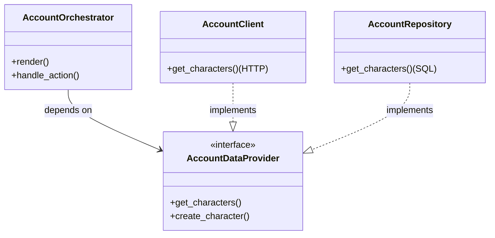

# Архитектура фичи (Contract-Based & Callback-Driven)

Этот документ описывает архитектурный стандарт реализации фич в Telegram-боте на примере фичи `Account`.

Архитектура решает две ключевые задачи:
1.  **Абстракция данных (Contract Layer):** Фича не должна знать, откуда берутся данные (HTTP API или прямой доступ к БД).
2.  **Сложное взаимодействие (Callback-Driven):** Управление состоянием и навигацией через Inline-кнопки без спама сообщениями.

---

## 1. Слой Контрактов (Contract Layer)

Главное архитектурное требование — **изоляция бизнес-логики от источника данных**.

Вместо прямого использования `AccountClient` или `AccountRepository`, оркестратор взаимодействует с абстракцией (Protocol). Это позволяет переключать режим работы бота (Standalone vs Microservice) без изменения кода фичи.

### Схема зависимости



### Реализация в коде

**Контракт (Protocol):**
```python
class AccountDataProvider(Protocol):
    async def get_characters(self, user_id: int) -> list[CharacterDTO]: ...
    async def create_character(self, user_id: int) -> CharacterDTO: ...
```

**Внедрение (DI):**
Контейнер (`BotContainer`) решает, какую реализацию подставить в зависимости от конфига (`ENV=PROD` или `ENV=LOCAL_DB`).

---

## 2. Callback-Driven Flow (Слой представления)

В отличие от команд (`/start`), работа с интерфейсом (Лобби, Инвентарь) требует сохранения контекста и обработки нажатий кнопок.

### Компоненты

1.  **Handlers (`handlers/`)**:
    *   Максимально "тонкие".
    *   Получают `CallbackQuery`.
    *   Достают нужный контракт из DI.
    *   Запускают Оркестратор.

2.  **Orchestrator (`system/orchestrator.py`)**:
    *   Управляет логикой.
    *   Вызывает методы Контракта (`self.data_provider.get_characters()`).
    *   Принимает решение: обновить экран, сменить состояние (FSM) или показать уведомление.

3.  **UI (`system/ui.py`)**:
    *   Чистая верстка.
    *   Генерирует тексты и клавиатуры на основе DTO.

### Тонкости реализации Handlers

Хендлеры выполняют критически важную роль в управлении жизненным циклом сообщений ("чистота чата").

**Паттерн "Snapshot & Clean" (при входе в фичу):**
Когда пользователь входит в фичу (например, через `/start` или кнопку меню), мы должны корректно удалить старый интерфейс, даже если сбрасываем состояние.

```python
@router.message(Command("start"))
async def cmd_start(m: Message, state: FSMContext, bot: Bot, container: BotContainer):
    # 1. Snapshot: Сохраняем данные старого состояния (там лежат ID сообщений для удаления)
    old_state_data = await state.get_data()

    # 2. Reset: Полный сброс FSM (новая фича - чистое состояние)
    await state.clear()

    # 3. User Action Cleanup: Удаляем сообщение пользователя (/start), чтобы не мусорить
    with contextlib.suppress(TelegramAPIError):
        await m.delete()

    # 4. Logic: Инициализация оркестратора через DI
    orchestrator = StartOrchestrator(
        auth_provider=container.auth_client, # <-- Внедрение зависимости
        ui=CommandsUI(),
        user=m.from_user,
    )
    view_dto = await orchestrator.handle_start()

    # 5. Render: ViewSender получает old_state_data, чтобы удалить старые сообщения
    sender = ViewSender(bot, state, old_state_data, m.from_user.id)
    await sender.send(view_dto)
```

**Роль ViewSender:**
`ViewSender` — это "умный почтальон". Он:
1.  Смотрит в `old_state_data` (или текущий state), есть ли там ID старых сообщений (`menu_msg_id`, `content_msg_id`).
2.  Если `view_dto.clean_history=True` — удаляет их.
3.  Если это обновление экрана — пытается сделать `edit_message_text`.
4.  Если редактирование невозможно (сообщение слишком старое) — удаляет и шлет новое.
5.  Записывает новые ID сообщений обратно в FSM (`KEY_UI_COORDS`).

---

## 3. Структура файлов фичи

```text
src/telegram_bot/features/account/
├── contracts/              # <-- СЛОЙ КОНТРАКТОВ
│   └── account_contract.py # Протокол доступа к данным
├── handlers/               # Обработчики (Router)
│   └── lobby_handlers.py   # DI, Snapshot, Call Orchestrator
├── system/
│   ├── orchestrator.py     # Логика (зависит от Contract, возвращает DTO)
│   └── ui.py               # Верстка (Pure functions)
├── resources/              # Тексты, кнопки, DTO
└── client.py               # Реализация контракта через API
```

## 4. Преимущества подхода

1.  **Гибкость деплоя:** Бот может работать как часть микросервисной архитектуры (через API) или как монолит (напрямую с БД) с одним и тем же кодом фич.
2.  **Чистота чата:** Благодаря связке `Handler (Snapshot)` + `ViewSender`, бот не оставляет за собой "хвост" из старых меню.
3.  **Изоляция:** UI не знает про базу данных, Хендлер не знает про бизнес-логику, Оркестратор не знает про Telegram API (он возвращает DTO).
